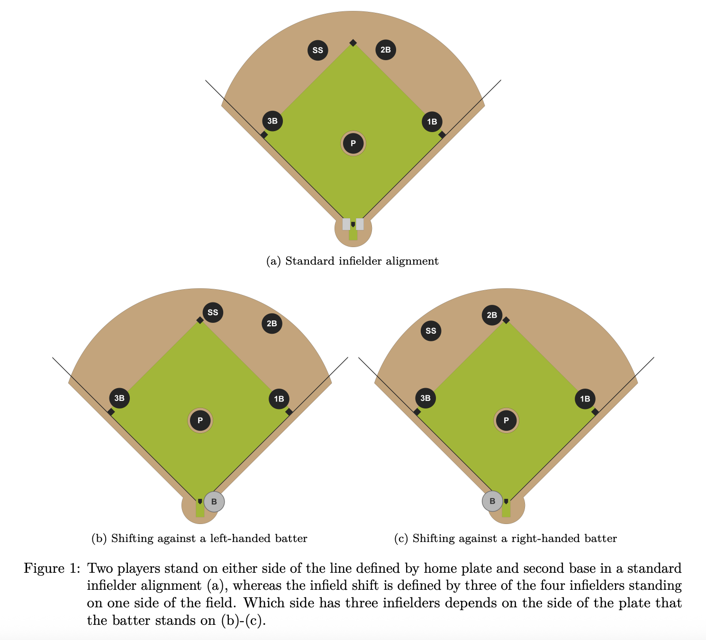
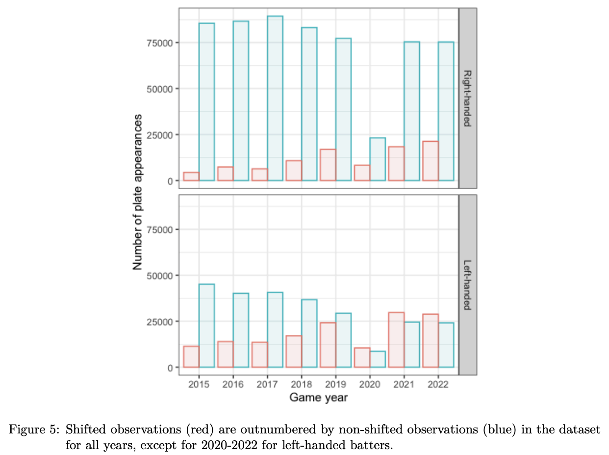
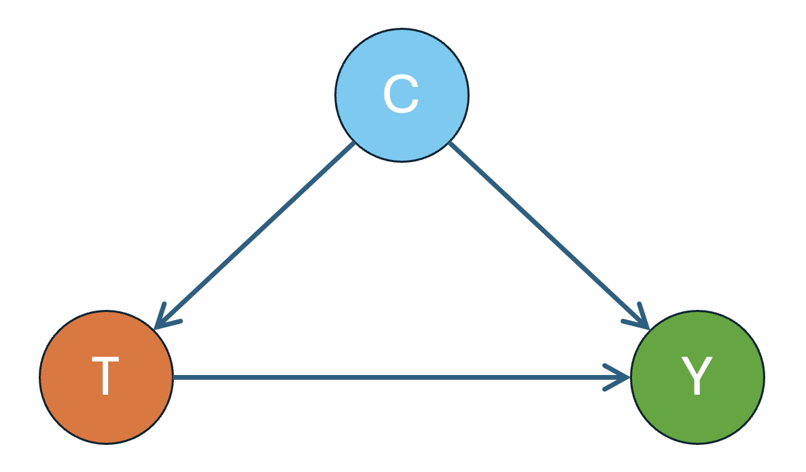

## 

:::: {.columns}
::: {.column width="55%"}
{width="100%"}
<small>
Rogers Centre, home of the Toronto Blue Jays  <br>
(Source: Wikimedia Commons)
</small>

:::

::: {.column width="45%"}
This workshop introduces core ideas in causal inference through a sports analytics case study.

Our main example is the MLB infield shift. We will study how causal methods can be used to evaluate whether the shift actually suppresses offensive production.
:::
::::


### Reference

Markes, S., Wang, L., Gronsbell, J., and Evans, K.  
<span class="blue-text">*Causal effect of the infield shift in the MLB* </span> 
arXiv:2409.03940

## Learning Objectives

By the end of the workshop, participants will be able to:

- Explain why evaluating the infield shift is a causal question rather than a purely descriptive one
- Describe treatment, outcome, confounding, and effect modification in this setting
- Understand the intuition behind matching and weighting
- Interpret the main findings of the paper and the assumptions behind each method


## Baseball in One Minute

### Two teams, two roles
- **Offense**: tries to score runs
- **Defense**: tries to prevent runs

::: {.fragment}
### What happens on each play
- The **pitcher** throws the ball
- The **batter** tries to hit it
- If the ball is put in play, the defense tries to get the batter out
:::
::: {.fragment}
### How a team scores
<span style="color:#1f4e79; font-weight:600;">A run is scored when a player safely advances around the bases and returns to home plate.</span>
:::

## Why Positioning Matters
::: {.fragment}
Hitters often tend to hit the ball toward certain parts of the field.
<span style="color:#b22222; font-weight:600;">So the defense may reposition its fielders before the pitch.</span>

That is why **defensive alignment** matters.
:::

::: {.fragment}
:::: {.columns}
::: {.column width="45%"}
- In a **standard alignment**, there are two infielders on each side of second base.
- In a **infield shift**, the defense moves three infielders to one side.
- Teams do this because some batters tend to hit the ball more often to one side of the field.
:::

::: {.column width="55%"}
{width="100%"}
:::
::::
:::

##
{width="100%" fig-align="center"}

## Infield Shift: Background
::: {.fragment}
The infield shift was not a small tactical tweak.

It became one of the defining features of modern MLB defense.

- Teams increasingly overloaded one side of the infield
- Shift usage roughly **tripled from 2015 to 2022**
- In **2023**, MLB restricted the shift by rule
:::
::: {.fragment}
The common belief was simple:

<span style="color:#b22222; font-weight:700;">the shift was hurting offense.</span>

But a belief is not the same as evidence.

### Did the shift actually cause lower offensive production?
:::

## Formation of the Question
::: {.fragment}
### Treatment $T$ 

The treatment is fielding alignment:

<ul class="tight-list">
  <li>$\color{blue}{T = 1}$: shifted alignment</li>
  <li>$\color{blue}{T = 0}$: non-shifted alignment</li>
</ul>

The paper uses Statcast’s public fielding alignment variable and combines standard and strategic alignments into the non-shifted category.
:::
::: {.fragment}
### Outcome $Y$

The outcome is scoring potential, measured through change in run expectancy.
$$
\Delta RE = RE_\text{final} - RE_\text{initial} + \Delta score
$$

:::

## This Is Not Just an Association Question

Suppose the data show:

<span style="color:#1f4e79; font-weight:700;">when teams use the shift, the batting team tends to score fewer expected runs.</span>

In statistical terms, this means we might observe:
$$E[Y \mid T = 1] < E[Y \mid T = 0]$$

We might even run a simple test, such as a **t-test**, and find a statistically significant difference between the average outcome in the treated group and untreated group.

:::{.fragment}
It is tempting to say:

<span style="color:#b22222; font-weight:700;">“The shift caused offense to go down.”</span>

But that conclusion is too quick.
:::

## The Causal Question

The paper asks:

Has the infield shift been effective at causing suppression of expected runs when it has been deployed?

This is a causal question because we want to compare:

- what happened when the shift was used
- what would have happened in the same situation had the shift not been used

For a given plate appearance, we want to compare two possible worlds:

- **Shift**: the defense uses the infield shift
- **No shift**: the defense stays in a standard alignment


## Potential Outcomes

- $\color{blue}{Y(1)}$: = the outcome if the defense shifts
- $\color{blue}{Y(0)}$: = the outcome if the defense does not shift

:::{.fragment}
The **individual causal effect** for that plate appearance is
$$\color{blue}{Y_i(1) - Y_i(0)}$$

The **average treatment effect (ATE)** is $$\color{blue}{E[Y(1)-Y(0)]}$$

The **effect of treatment on the treated (ETT)** is $$\color{blue}{E[Y(1)-Y(0)\mid T=1]}$$
:::

## The Fundamental Problem
::: {.fragment}
For any single plate appearance, we only observe $\color{red}{one}$ of these two outcomes:
either the defense shifted, or it did not.

We never observe both for the same play.
:::
::: {.fragment}
<span class="blue-text">Consistency assumption</span>:
$$
Y = TY(1) + (1-T)Y(0)
$$
:::
:::{.fragment}
To estimate ATE, 
\begin{align*}
\hat{E}[Y(1) - Y(0)] = \frac{1}{n}\sum_{i=1}^n[Y_i(1) - Y_i(0)]
\end{align*}
But we don't observe $Y_i(1)-Y_i(0)$ for any $i$, so we can't calculate the average. 

:::


## Why Randomized Trials are Ideal

$$
{E}[Y(1) - Y(0)] = {E}[Y(1)] - {E}[Y(0)]
$$
Can we estimate ${E}[Y(1)]$ and ${E}[Y(0)]$ separately instead?

::: {.fragment}
Imagine an experiment where, before each plate appearance, we <span class="blue-text">randomly assign</span>:
<ul class="tight-list">
  <li>some plays to use the shift</li>
  <li>some plays to use the standard alignment</li>
</ul>
In math, we have $T$ is independent of any other variable, thus
$$
T\perp Y(0), Y(1)
$$
$E[Y(t)] = E[Y(t)\mid T] = E[Y(t)\mid T=t] = E[Y\mid T=t]$
:::

## Intuition Behind Randomized Trials
::: {.fragment style="margin-bottom: 30px;"}
$$\hat{E}[Y(1) - Y(0)] = \hat{E}(Y\mid T=1) - \hat{E}(Y\mid T=0)$$
ATE can be estimated by the difference between average outcomes in treated and untreated groups.<br>
::: 
::: {.fragment style="margin-bottom: 30px;"}
<span class="red-text">Wait a minute...</span> We said earlier we <span class="red-text">could not</span> simply comparing the average outcomes? 
:::

::: {.fragment}
Here we can do this because of <span class="blue-text">randomization</span>. 

By randomizing the treatment, the shifted and non-shifted groups would be comparable on average.

So a difference in average outcomes would have a natural causal interpretation.
:::

## What Happens in Reality?
::: {.fragment}
In MLB, teams do $\color{red}{not}$ randomize the shift.

They choose the shift <span class="blue-text">on purpose</span>, usually when they think it will help. This may depend on:

<ul class="tight-list">
  <li>batter tendencies</li>
  <li>pitcher characteristics</li>
  <li>game situation</li>
  <li>team preferences</li>
</ul>
:::
::: {.fragment}
So the shifted plays and the non-shifted plays are already different before the pitch is thrown.

A simple comparison may reflect both:
<ul class="tight-list">
<li>the true effect of the **shift**</li>
<li>the effect of the **situation in which the shift was chosen**</li>
</ul>
:::


## Confounding

{width="70%" fig-align="center"}

- treatment (T): fielding alignment
- outcome (Y): scoring chance / expected runs
- confounders (C): batter attributes, pitcher attributes, game context, etc

## Assumptions on Confounding
{width="70%" fig-align="center"}

For randomized trials, there is no confounder, because treatment $T$ is independent of anything.

For observational studies, we assume
$$
T\perp Y(0), Y(1) \mid C
$$
and we observe all confounders.


## Why Not Just Compare Exactly the Same Situations?
::: {.fragment}
A natural idea is:

> compare shifted and non-shifted plate appearances under exactly the same conditions

For example, we might try to match plays with the same:

batter, pitcher, count, baserunner situation, inning and score...
:::
::: {.fragment}

<br>
But this is often too restrictive.

Even with several MLB seasons of data, many exact combinations occur very rarely.

So if we insist on exact matching, we may be left with very little usable data.
:::


## Matching: Compare Similar Situations

### A more practical idea

Instead of requiring plays to be <span class="red-text">identical</span>, we look for plays that are <span class="red-text">similar</span> in important observed characteristics.

:::{.fragment}
### Main idea

For each shifted plate appearance, find one or more non-shifted plate appearances that look similar in observed variables.

Then compare their outcomes.

In this setting, we might match on

<ul class="tight-list">
  <li>batter attributes</li>
  <li>pitcher attributes</li>
  <li>game context</li>
  <li>other observed pre-pitch information</li>
</ul>  

:::

## Data Source

The paper uses publicly available MLB Statcast data from 2015 to 2022.

The data are pitch-level observations and include:

- batter and pitcher identifiers
- pre-pitch game context
- fielding alignment
- pitch characteristics
- outcome-related information

This is observational data, not randomized experimental data. 


## Data Source (Simulated)

Because we do not use the real Statcast data here, we will illustrate the method using a **simulated observational dataset** with the same basic structure.

```{r}
#| echo: true
set.seed(123)

n <- 300

# Covariates
pull <- runif(n)                      # batter pull tendency
lefty <- rbinom(n, 1, 0.4)            # 1 = left-handed batter
two_strikes <- rbinom(n, 1, 0.4)
runner1 <- rbinom(n, 1, 0.3)
outs <- sample(0:2, n, replace = TRUE)

# Treatment assignment (observational, not randomized)
logit_p <- -1 + 2*pull + 0.8*lefty + 0.6*two_strikes + 0.4*runner1
p_shift <- 1 / (1 + exp(-logit_p))
T <- rbinom(n, 1, p_shift)

# Heterogeneous treatment effect:
# right-handed batters: effect = -0.05
# left-handed batters:  effect = -0.15
tau_right <- -0.05
tau_left  <- -0.15

tau_i <- ifelse(lefty == 1, tau_left, tau_right)

# Outcome
Y <- 0.4*pull - 0.2*two_strikes + 0.15*runner1 - 0.08*outs + 
     0.05*lefty + tau_i*T + rnorm(n, 0, 0.1)

data <- data.frame(
  pull, lefty, two_strikes, runner1, outs, T, Y
)

```

## Nearest-Neighbor Matching 
:::{.fragment}
### Step 1: Describe each play

For every plate appearance, record observed variables $C$, such as:

batter pull tendency, batter handedness, count (two strikes), runners on base, outs

These summarize the situation **before the pitch**.
:::
::: {.fragment}
###
```{r}
#| echo: true
#| eval: true
#| warning: false
head(data, 6)
```
:::

## 

### Step 2: Measure similarity

For a shifted play $T=1$, we compare its $C$ to all non-shifted plays $T=0$.

We define a notion of “distance” between two plays:

<div style="text-align: center;">
smaller distance = more similar situations
</div>

A common choice is **Euclidean distance**.

:::{.fragment}
```{r}
#| echo: true
#| eval: true
#| warning: false

match_vars <- c("pull", "lefty", "two_strikes", "runner1", "outs")

X <- scale(data[, match_vars])

dist_fun <- function(x, Z) {
  sqrt(rowSums((Z - matrix(x, nrow(Z), length(x), byrow = TRUE))^2))
}
```
:::


##
### Step 3: Find the nearest neighbor

For each shifted play, find the non-shifted play with the **smallest distance** in $C$.

```{r}
#| echo: true
#| eval: true
#| warning: false

treated_idx <- which(data$T == 1)
control_idx <- which(data$T == 0)

treated <- data[treated_idx, ]
control <- data[control_idx, ]

match_index_treated <- sapply(1:nrow(treated), function(i) {
  x <- X[treated_idx[i], ]
  dists <- dist_fun(x, X[control_idx, , drop = FALSE])
  which.min(dists)
})

matched_control <- control[match_index_treated, ]

match_index_control <- sapply(1:nrow(control), function(i) {
  x <- X[control_idx[i], ]
  dists <- dist_fun(x, X[treated_idx, , drop = FALSE])
  which.min(dists)
})

matched_treated <- treated[match_index_control, ]

```

##

### Step 5: Average over all pairs

Average these differences across all matched pairs to estimate the effect of the shift.
```{r}
#| echo: true
#| eval: true
#| warning: false
library(dplyr)

treated$effect_hat <- treated$Y - matched_control$Y
control$effect_hat <- matched_treated$Y - control$Y

matched_data <- bind_rows(treated, control)

ate_match <- mean(matched_data$effect_hat)

true_ate <- mean(tau_i)
c(Matching_ATE = ate_match, True_ATE = true_ate)
```


## Effect Modification by Batter Handedness
:::{.fragment}
```{r}
#| echo: true
#| eval: true
#| warning: false
library(dplyr)

# Match within handedness groups
match_vars <- c("pull", "two_strikes", "runner1", "outs")
X <- scale(data[, match_vars])

dist_fun <- function(x, Z) {
  sqrt(rowSums((Z - matrix(x, nrow(Z), length(x), byrow = TRUE))^2))
}

# Left-handed batters
left_data <- data %>% filter(lefty == 1)
left_treated_idx <- which(data$T == 1 & data$lefty == 1)
left_control_idx <- which(data$T == 0 & data$lefty == 1)

match_left_treated <- sapply(left_treated_idx, function(i) {
  dists <- dist_fun(X[i, ], X[left_control_idx, , drop = FALSE])
  left_control_idx[which.min(dists)]
})

match_left_control <- sapply(left_control_idx, function(i) {
  dists <- dist_fun(X[i, ], X[left_treated_idx, , drop = FALSE])
  left_treated_idx[which.min(dists)]
})

left_effects <- c(
  data$Y[left_treated_idx] - data$Y[match_left_treated],
  data$Y[match_left_control] - data$Y[left_control_idx]
)

# Right-handed batters
right_treated_idx <- which(data$T == 1 & data$lefty == 0)
right_control_idx <- which(data$T == 0 & data$lefty == 0)

match_right_treated <- sapply(right_treated_idx, function(i) {
  dists <- dist_fun(X[i, ], X[right_control_idx, , drop = FALSE])
  right_control_idx[which.min(dists)]
})

match_right_control <- sapply(right_control_idx, function(i) {
  dists <- dist_fun(X[i, ], X[right_treated_idx, , drop = FALSE])
  right_treated_idx[which.min(dists)]
})

right_effects <- c(
  data$Y[right_treated_idx] - data$Y[match_right_treated],
  data$Y[match_right_control] - data$Y[right_control_idx]
)

effect_by_hand <- tibble(
  handedness = c("Left-handed", "Right-handed"),
  matched_effect = c(mean(left_effects), mean(right_effects)),
  true_effect = c(-0.15, -0.05)
)

effect_by_hand
```
:::

## From Matching to Weighting

### What did matching do?

- Compare **similar situations**
- Discard plays that are too different

We may throw away a lot of data.

:::{.fragment}
### Another idea

Instead of discarding data, we can:

<div style="text-align: center;">
<span style="color:#1f4e79; font-weight:700;">
keep all plays, but rebalance them
</span>
</div>

so that shifted and non-shifted plays become comparable overall.
:::
:::{.fragment}
### How?

By assigning **weights** to each play.

This leads to <span class="red-text">Inverse Probability Weighting (IPW)</span>.
:::


## Inverse Probability Weighting (IPW)

### Key intuition

Some plays are **more likely** to receive the shift than others.

For example:

- strong pull hitters → more likely to be shifted
- certain game situations → more likely to be shifted

:::{.fragment}
This can be measured by the <span class="red-text">propensity score</span>
$$
P(T = 1\mid C)
$$
Higher propensity score → more likely to be shifted 
:::

##


To make the treated/untreated groups more comparable, we 

- give the units in the treated group more weight if they are less likely to be treated, 
- and give the units in the untreated group more weight if they are more likely to be treated. 

### Result

After weighting, the two groups look more similar:

<span style="color:#b22222; font-weight:700;">
as if the shift had been assigned more randomly
</span>

### Connection to matching

- Matching: compare **pairs of similar plays**
- IPW: adjust **the whole dataset**


## IPW: Identification Formula
Under the assumption that
$$
T \perp Y(0), Y(1) \mid C,
$$
one can show
\begin{align*}
E[Y(t)] = E\left[ \frac{\mathbb{I}(T=t)Y}{P(T=t\mid C)}\right]
\end{align*}
Therefore, 

- to estimate $E[Y(1)]$, we take the weighted average of outcomes in the treated group, where the weight is $1/P(T=1\mid C)$

- to estimate $E[Y(0)]$, we take the weighted average of outcomes in the untreated group, where the weight is $1/P(T=0\mid C)$.

## IPW: How the Estimation Works
:::{.fragment}
### Step 1: Estimate propensity score

For each play, estimate the propensity score $P(T=1 \mid C)$

:::
:::{.fragment}
We use a logistic regression model for the propensity score:
```{r}
#| echo: true
ps_model <- glm(
  T ~ pull + two_strikes + runner1 + outs + lefty,
  data = data,
  family = binomial()
)

data$ps <- predict(ps_model, type = "response")

head(data[, c("T", "pull", "two_strikes", "runner1", "outs", "lefty", "ps")])
```
:::

##
### Step 2: Compute weighted averages
$$
\hat{E}[Y(1)] = \frac{1}{n} \sum^n_{i=1} \frac{\mathbb{I}(T_i=1) Y_i}{P(T_i=1 \mid C_i)},
\ 
\hat{E}[Y(0)] = \frac{1}{n} \sum^n_{i=1} \frac{\mathbb{I}(T_i=0) Y_i}{P(T_i=0 \mid C_i)}
$$
```{r}
#| echo: true
data$w1 <- ifelse(data$T == 1, 1 / data$ps, 0)
data$w0 <- ifelse(data$T == 0, 1 / (1 - data$ps), 0)

head(data[, c("T", "ps", "w1", "w0")])

EY1_hat <- mean(data$T * data$Y / data$ps)
EY0_hat <- mean((1 - data$T) * data$Y / (1 - data$ps))

c(EY1_hat = EY1_hat, EY0_hat = EY0_hat)

```


##
### Step 3: Estimate causal effect

$$
\widehat{ATE} = \hat{E}[Y(1)] - \hat{E}[Y(0)]
$$
```{r}
#| echo: true
ate_ipw <- EY1_hat - EY0_hat
ate_ipw

psi <- data$T * data$Y / data$ps -
       (1 - data$T) * data$Y / (1 - data$ps)

se_ipw <- sqrt(var(psi) / nrow(data))

se_ipw

c(
  True_ATE = true_ate,
  Matching_ATE = ate_match,
  IPW_ATE = ate_ipw
)
```

## Effect Modification by Batter Handedness
```{r}
#| echo: true
effect_by_hand <- data %>%
  group_by(lefty) %>%
  summarise(
    ipw_effect =
      mean(T * Y / ps) -
      mean((1 - T) * Y / (1 - ps)),
    se =
      sqrt(
        var(
          T * Y / ps -
          (1 - T) * Y / (1 - ps)
        ) / n()
      ),
    .groups = "drop"
  ) %>%
  mutate(
    handedness = ifelse(lefty == 1, "Left-handed", "Right-handed")
  )

effect_by_hand
```

## Main Result

Across methods, the paper finds that the infield shift is effective at preventing runs primarily for **left-handed batters**.

For **right-handed batters**, the conclusion is more sensitive to assumptions and method choice.

<br>

:::{.fragment}
### Why This Result Makes Baseball Sense

The infield shift is designed partly around pull tendencies.

Because the geometry and running structure of baseball are asymmetric, the strategic consequences of shifting can differ by batter handedness.

So the handedness-specific result is not only statistically interesting, but also substantively plausible.
:::


## Limitations and Cautions

Important limitations include:

- observational data only
- possible unmeasured confounding (the paper also uses IV to deal with it)
- public fielding alignment data are coarser than the internal positioning data teams may have

So causal conclusions remain assumption-dependent.


## Take-Home Messages

- Evaluating sports strategy is often a causal inference problem
- The MLB infield shift is a compelling observational case study
- Matching, weighting, and many other methods provide different routes to causal estimation
- In this paper, the evidence suggests the shift mainly suppresses runs against left-handed batters